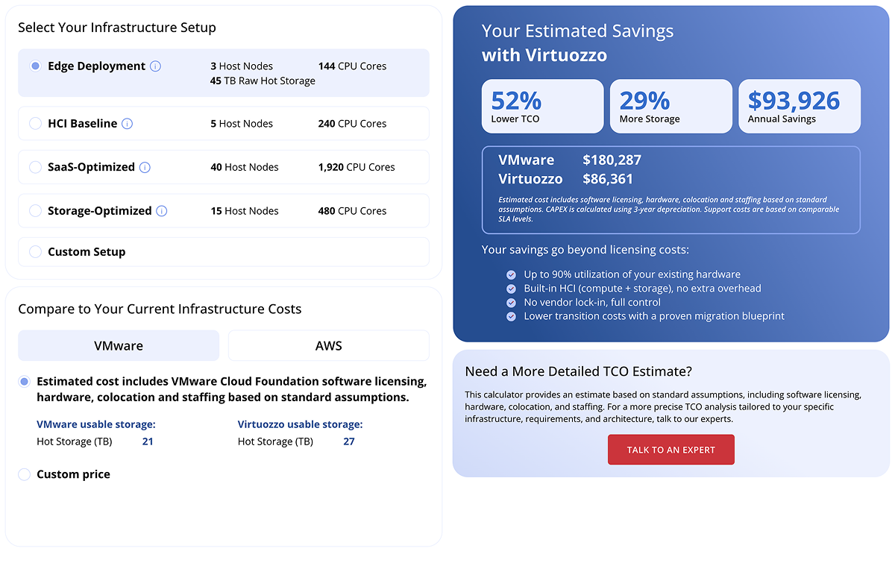

# Virtuozzo TCO Calculator Widget

[Virtuozzo TCO Calculator](https://www.virtuozzo.com/tco-calculator/) widget is an interactive tool that estimates the total cost of ownership of a Virtuozzo-based infrastructure compared to VMware or AWS. It is built on standard HTML, JavaScript, and CSS technologies supported by all modern browsers, which ensures easy installation on any page without additional requirements. Initialization is performed in the background and does not affect page loading speed.

Widget addition to your site can be accomplished in a few simple steps:

1. All the required scripts, styles, and templates for the TCO calculator widget are stored in the `vz-tco-calculator` directory. You can get this folder from the appropriate repository. For example, with the following command:

    ```
    git clone https://github.com/virtuozzo/tco-calculator-widget.git
    ```

   `Tip: If you want to customize the widget appearance, refer to the linked section and adjust files within the directory to your needs.`

2. Add the `vz-tco-calculator` folder to your site's root folder and insert the following lines between the `<head>` and `</body>` tags of the required page:

    ```html
    <link rel="stylesheet" href="{siteUrl}/vz-tco-calculator/css/vz-tco-calculator.min.css">

    <script src="{siteUrl}/vz-tco-calculator/js/plugins/jquery-3.7.1.min.js"></script>
    <script src="{siteUrl}/vz-tco-calculator/js/vhc-signup-widget.min.js"></script>
    ```

   Don't forget to correctly substitute your ***{siteUrl}*** placeholder. If jQuery is already loaded on the page, omit the jQuery `<script>` tag.

3. Insert the following block at the position where the widget should be displayed:

    ```html
    <div class="vz-tco-calculator" data-base-url="{siteUrl}/"></div>
    ```

The default ready-to-work TCO calculator widget looks as follows:



### Pricing Data

The widget uses a separate pricing file (`pricings.min.js`) hosted on the Virtuozzo website. This allows pricing data to be updated centrally without requiring any changes to the widget itself.

By default, the widget loads this file automatically by injecting a `<script>` tag into `<head>` at runtime. No additional setup is required.

However, for better performance it is recommended to include it explicitly before the widget script:

```html
<script src="https://www.virtuozzo.com/wp-content/themes/virtuozzo/widgets/vz-tco-calculator/pricings.min.js"></script>
<script src="{siteUrl}/vz-tco-calculator/js/vhc-signup-widget.min.js"></script>
```

When loaded this way, the widget detects the file is already available and skips the dynamic injection entirely.

#### Custom Pricing Override

You can supply your own pricing data instead of the Virtuozzo defaults. The widget checks whether a `TCOPricings` global object is already defined before loading the default file — so any script that defines `TCOPricings` before the widget script will take precedence.

1. Use the default `pricings.min.js` as a reference for the data structure.
2. Create your own file (e.g. `my-pricings.js`) with the same structure and your custom values.
3. Include it before the widget script:

```html
<script src="{siteUrl}/my-pricings.js"></script>
<script src="{siteUrl}/vz-tco-calculator/js/vhc-signup-widget.min.js"></script>
```

The widget will use your prices and skip loading the default file entirely.

### Widget Parameters

The widget supports the following `data-*` attributes on the root element:

Parameter | Description | Default
--- | --- | ---
`data-base-url` | Base URL used to load the EJS template (`partial/widget.ejs`). Should point to the root of the `vz-tco-calculator` folder with a trailing slash. | Current host root
`data-button-link` | URL that the primary CTA button links to. | `https://www.virtuozzo.com/tco-calculator/`
`data-button-text` | Label text displayed on the primary CTA button. | `TALK TO AN EXPERT`

Example with all parameters:

```html
<div class="vz-tco-calculator"
    data-base-url="https://example.com/"
    data-button-link="https://virtuozzo.com/contact/"
    data-button-text="Talk to Sales"
></div>
```

### Calculator Scenarios

The widget provides four preset infrastructure scenarios and a fully configurable custom mode:

Scenario | Nodes | CPUs | Description
--- | --- | --- | ---
**Edge Deployment** | 3 | 144 | Lightweight edge footprint, hot storage only
**HCI Baseline** | 5 | 240 | Hyper-converged baseline with hot and cold storage
**SaaS-optimized** | 40 | 1,920 | High-density compute for SaaS workloads
**Storage-optimized** | 15 | 480 | Heavy cold storage with dedicated storage nodes
**Custom setup** | — | — | User-defined compute and storage nodes, EC schemes, and per-node capacities

### Competitor Comparison

For each scenario, the widget compares Virtuozzo against either **VMware** or **AWS**. The competitor pricing mode can be set to one of three options:

- **Estimated VMware** — uses precalculated VMware VCF license and infrastructure costs
- **Estimated AWS** — uses precalculated AWS EC2 + EBS + S3 Glacier costs
- **Custom price** — allows entering a per-node annual cost manually (and a per-TB cold storage cost for HCI + AWS)

### Customize Widget Layout

The widget source code is in the `app/` directory and is built with **Gulp** using [SCSS](https://sass-lang.com/). The build process produces minified CSS/JS files into the `vz-tco-calculator/` distribution folder.

In order to customize the project, you will need [Node.js](https://nodejs.org/) v6 or higher.

1. Install the [Gulp](https://gulpjs.com/) CLI globally:

    ```
    npm install gulp --global
    ```

2. Clone the widget repository:

    ```
    git clone https://github.com/virtuozzo/tco-calculator-widget.git
    ```

3. Move into the project folder and install dependencies:

    ```
    cd tco-calculator-widget
    npm install
    ```

4. Start the watcher to rebuild files on change:

    ```
    gulp default
    ```

   The watcher tracks the following source files:
   - `app/scss/vz-tco-calculator.scss` — styles
   - `app/js/vz-tco-calculator.js` — widget logic
   - `app/partial/widget.ejs` — HTML template

5. You can change styles in `app/scss/vz-tco-calculator.scss`. To build a production distribution without the watcher, run:

    ```
    gulp sass && gulp js && gulp copy-resources
    ```

   This will produce the following files in the `vz-tco-calculator/` folder:

   - `css/vz-tco-calculator.min.css` — minified CSS
   - `js/vhc-signup-widget.min.js` — minified JavaScript (includes EJS, tooltip, and popover plugins)
   - `partial/widget.ejs` — HTML template
   - `js/plugins/` — bundled third-party plugins
   - `img/` — static assets

Use these files when integrating the widget into your website.
